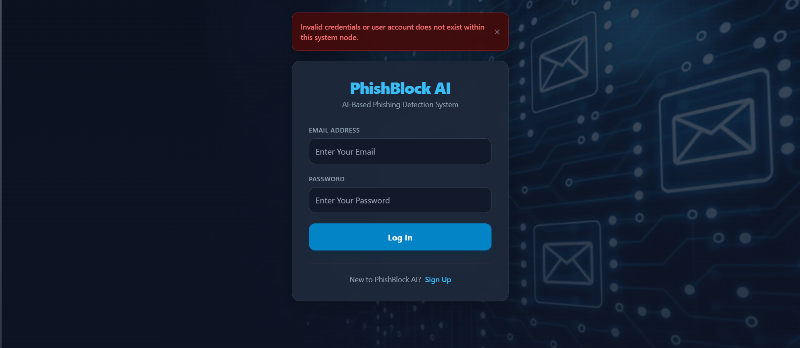
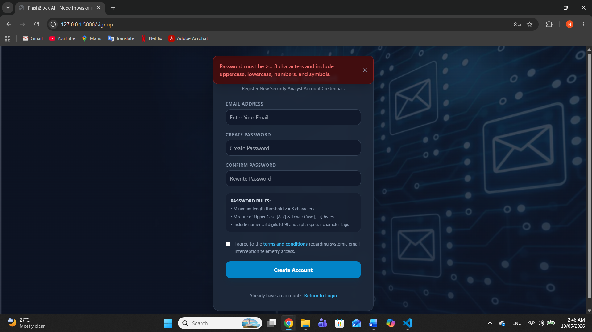
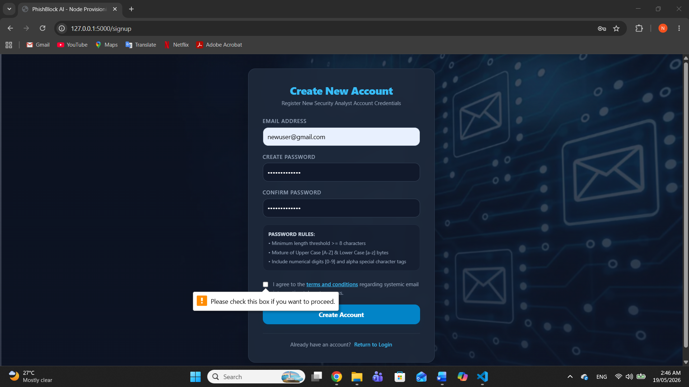
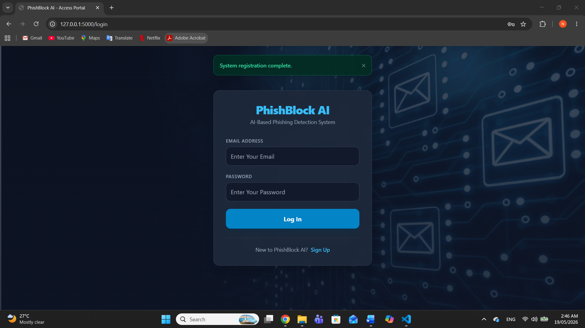
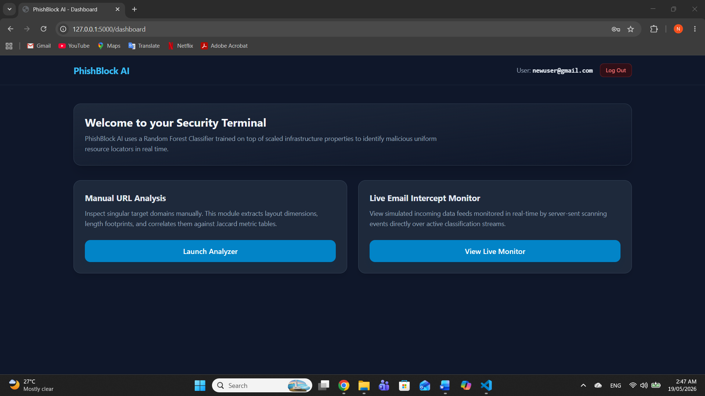
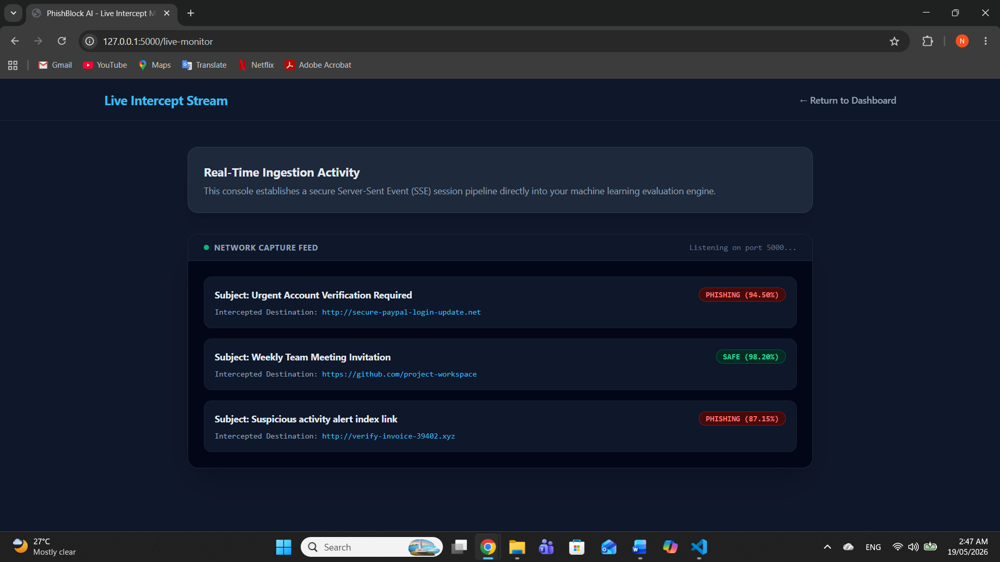
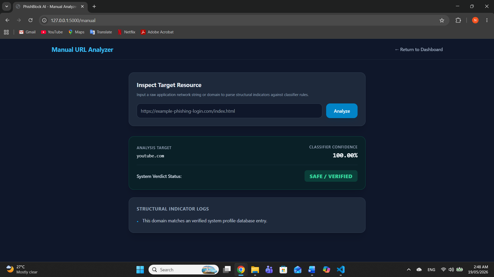
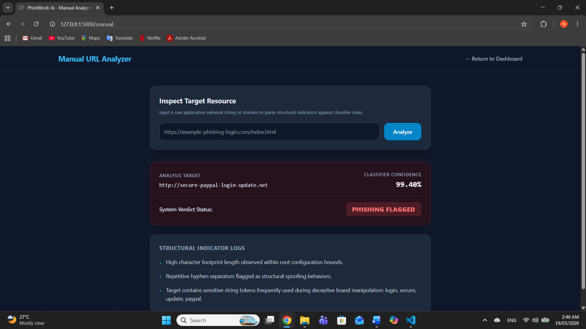
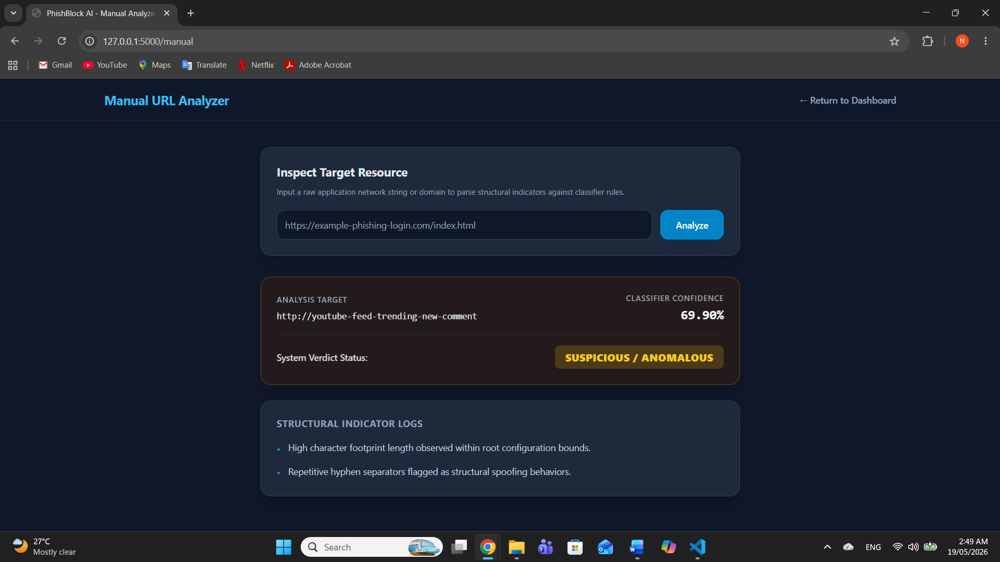
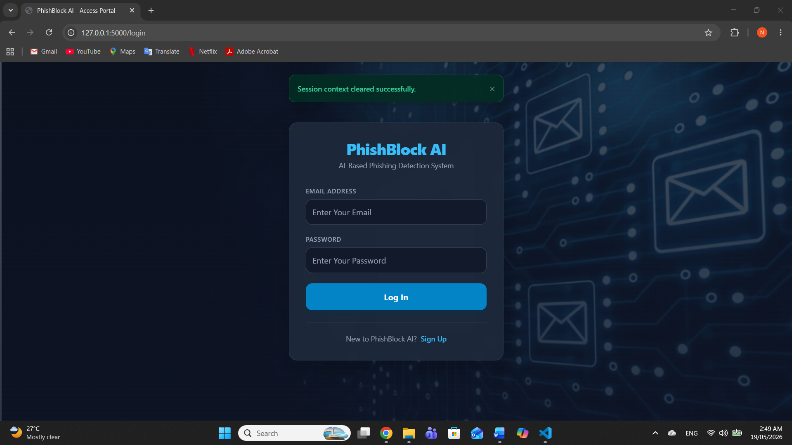

# PhishBlock AI

An AI-powered phishing website detection system using machine learning and URL/content-based features.

## Overview

PhishBlock AI is a Flask-based web application developed as a graduation project for the Bachelor of Cyber Security program at Canadian University Dubai.

The project demonstrates how artificial intelligence and machine learning techniques can be applied to cybersecurity by detecting potentially malicious phishing URLs. The application simulates an email scanning environment where users can test whether URLs extracted from emails are classified as phishing or legitimate.

> **Note:** This project was developed for educational purposes and simulates an email phishing detection workflow. It does not connect to or scan real email accounts.

---

## Features

- Machine learning-based phishing URL detection
- Simulated email scanning workflow
- User login simulation
- URL analysis and classification
- Flask-based web application
- Frontend interface developed using HTML and CSS
- Detection of phishing and legitimate URLs

---

## Technologies Used

- Python
- Flask
- HTML
- CSS
- Pandas
- NumPy
- Scikit-learn
- Machine Learning

---

## Model Performance

The trained phishing detection model achieved:

- **Accuracy:** 95.01%

The model was trained using URL and content-based features to distinguish between phishing and legitimate websites.

---

## Test Cases

The application was tested under different scenarios to verify functionality, including login validation and phishing detection behavior.

### Test Case 1


### Test Case 2


### Test Case 3


### Test Case 4


### Test Case 5


### Test Case 6


### Test Case 7


### Test Case 8


### Test Case 9


### Test Case 10


### Test Case 11


---

## Dataset

This project uses the **PhishStorm – Phishing / Legitimate URL Dataset** developed by Aalto University.

The dataset is not included in this repository due to licensing considerations. The dataset can be obtained from the official Aalto University research repository.

---

## Installation

1. Clone this repository:

```bash
git clone https://github.com/nadaibrahim04/phishblock-ai.git
```

2. Navigate to the project folder:

```bash
cd phishblock-ai/phishing_app
```

3. Install the required dependencies:

```bash
pip install -r requirements.txt
```

4. Run the application:

```bash
python app.py
```

---

## Project Structure

```
phishblock-ai/
│
├── phishing_app/
│   ├── app.py
│   ├── requirements.txt
│   ├── templates/
│   └── static/
│
├── test_cases/
│   ├── test_case_1.png
│   ├── test_case_2.png
│   └── ...
│
├── README.md
└── .gitignore
```

---

## Future Improvements

- Integration with real email APIs
- Browser extension support
- Real-time phishing detection
- Improved feature extraction techniques
- Deployment as a cloud-based security service

---

## Team Members

This project was developed by:

- Nada Ibrahim
- Lana Alnajjar
- Lara Ali

Bachelor of Cyber Security  
Canadian University Dubai
